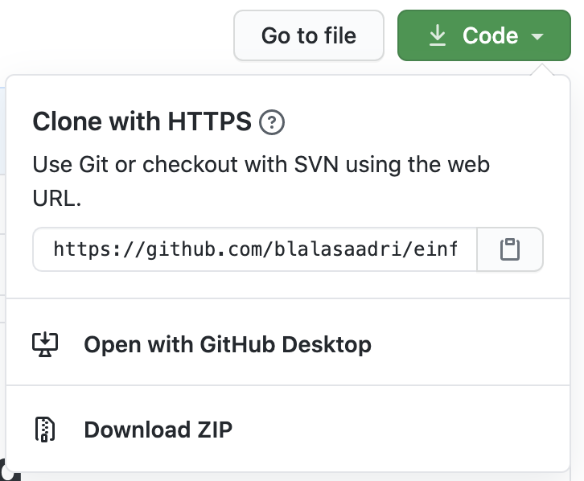

= Materialien für die Schulung _"Einführung in die Programmierung"_
:author: Alasdair Collinson
:orgname: ITB Consulting GmbH
:revdate: 2020-09-08
:revnumber: 0.2
:doctype: article
:icons: font
:source-highlighter: rouge
:lang: de
:toc-title: Inhaltsverzeichnis
:caution-caption: Achtung
:important-caption: Wichtig
:note-caption: Hinweis
:tip-caption: Tipp
:warning-caption: Warnung
:appendix-caption: Anhang
:example-caption: Beispiel
:figure-caption: Abbildung
:table-caption: Tabelle

Dieses https://de.wikipedia.org/wiki/Repository[Repository] enthält Materialien für die Schulung "Einführung in die Programmierung" bei der https://www.itb-consulting.de/[ITB Consulting GmbH].

Wie lade ich die Materialien herunter?::
Auf https://github.com/blalasaadri/einfuehrung-in-die-programmierung[GitHub] findet sich der Knopf  welcher ein Menü öffnet.
Das Menü sieht wie folgt aus:
+
[.float-group]
--

--
+
Wenn man hier auf _Download ZIP_ klickt, erhält man den gesamten Inhalt des Repositories als ZIP-Datei.

Wie sehe ich die Webseite, die hiermit gebaut wird?::
Im Verzeichnis link:JavaScript[] finden sich zwei Arten von Dateien:
+
  - link:JavaScript/index.html[index.html]
  - Dateien, die mit zwei Ziffern beginnen und auf `skript.js` enden.
+
Diese Datein ergeben gemeinsam eine kleine Webseite.
Dabei teilen sie sich die Aufgaben auf:
+
  - Die HTML-Datei sorgt dafür, dass eine Struktur der Webseite vorgegeben wird.
  - Die JS-Dateien kann den Inhalt die Darstellung der HTML-Datei im Browser manipulieren.
+
Um das Ergebnis zu sehen, kann man einfach die Datei link:JavaScript/index.html[index.html] in einem Browser (z.B. Edge, Firefox oder Chrome) öffnen.
Falls man an einer der beiden Dateien etwas ändert, werden diese Änderungen erst nach einem erneuten Laden der Seite im Browser sichtbar.

Wo finde ich weitere Informationen zu HTML?::
Das https://wiki.selfhtml.org/wiki/HTML/Tutorials/Einstieg[HTML Einsteiger-Tutorial] von selfhtml ist ein guter Anfang.
Für das, was wir in dieser Schulung machen, reichen dabei die Inhalte der ersten beiden Kapitel.
+
Für tiefergehende Informationen zu den einzelnen Elementen sind die https://developer.mozilla.org/de/docs/Web/HTML/Element[Mozilla Developer Networks web docs] extrem nützlich.
Diese sind in Deutsch verfügbar, falls die deutschsprachige Dokumentation nicht ausreicht findet sich aber manchmal in der englischsprachigen mehr.

Wo finde ich weitere Informationen zu JavaScript?::
Auch zu JavaScript gibt es ein https://wiki.selfhtml.org/wiki/JavaScript/Tutorials/Einstieg[Einsteiger-Tutorial von selfhtml].
Dabei sind die Kapitel 1 bis 3 alle interessant.
+
Und auch zu JavaScript gibt es in den https://developer.mozilla.org/de/docs/Web/JavaScript/Reference[Mozilla Developer Networks web docs] viele Informationen.
Für diese Schulung werden voraussichtlich hauptsächlich Einträge aus _Referenzen -> Anweisungen & Deklarationen_ relevant sein.
